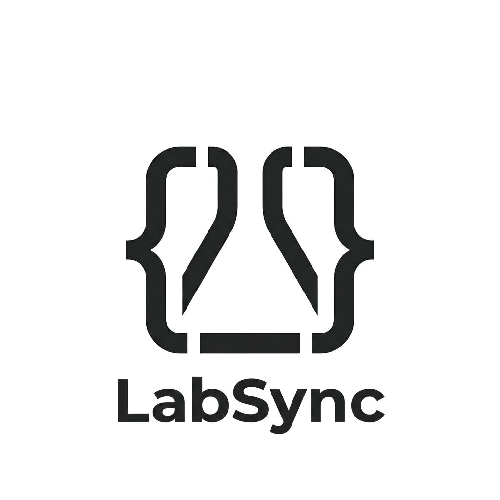
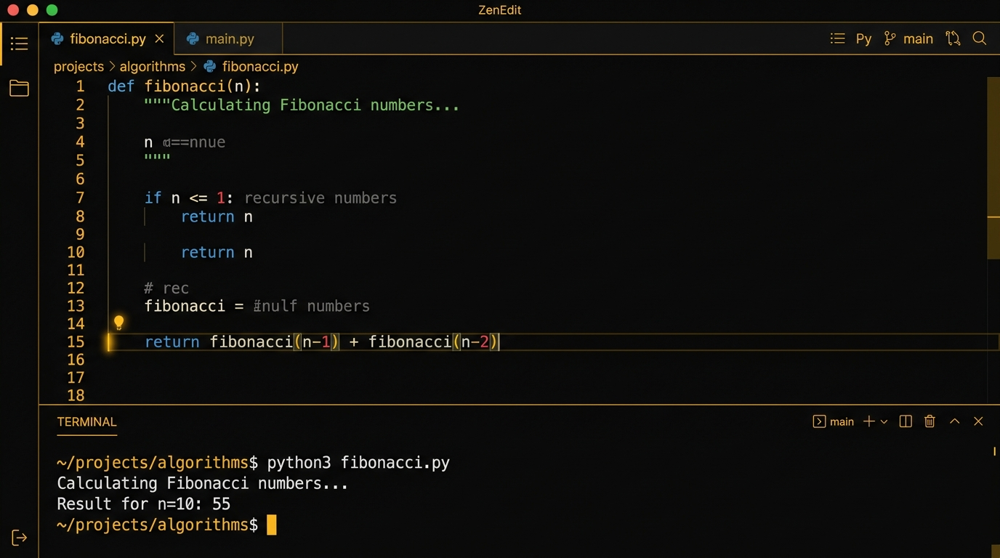
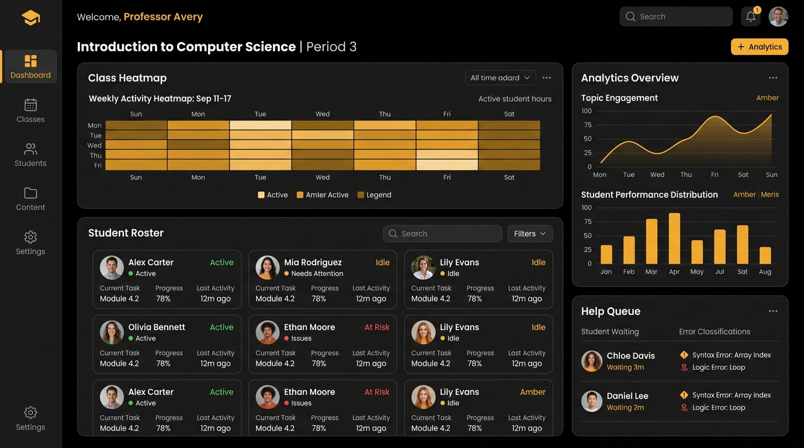

<div align="center">



# LabSync

**Real-time code diagnostics for college programming labs.**

Diagnose every student’s code. Before they even raise a hand.

[Live Demo](https://labsync.vercel.app) · [Task Board](TASKS.md) · [Report Bug](https://github.com/Aazhs/labsync/issues) · [Request Feature](https://github.com/Aazhs/labsync/issues)

</div>

---

## What is LabSync?

LabSync combines a zero-setup browser IDE with **real-time diagnostic intelligence** — automatically classifying student code errors (Syntax → Logic → Conceptual) so professors can help every student in the room immediately.

In a typical 60-student programming lab, the professor has no idea who's stuck, who's idle, and who's copying. LabSync changes that with:

- **Real-time error classification** — every student error is categorized (Syntax → Logic → Conceptual) before it reaches the professor
- **AI-guided hints** — asks *"what happens when i reaches 5?"* instead of giving the answer
- **Live instructor dashboard** — a prioritized help queue with diagnosis already attached

> **Philosophy:** Remove guesswork, not the teacher.

---

## Features

| Feature | Description |
|---|---|
| **Zero-Setup Cloud IDE** | Students open a link and start coding. No compilers, no config. |
| **Live Code Sync** | Follow Mode mirrors the professor's editor to every student. |
| **AI Lab Assistant** | Guided Socratic hints — never spoon-feeds answers. |
| **Instructor Dashboard** | Real-time queue of stuck students with classified error diagnosis. |
| **Error Classification Engine** | Three-tier diagnosis: Syntax → Logic → Conceptual. |
| **Academic Integrity** | AST-level code similarity detection + AI-generation flagging. |

---

## Screenshots

### Landing Page


### Instructor Dashboard


---

## Tech Stack

| Layer | Technology |
|---|---|
| **Framework** | [Next.js 16](https://nextjs.org) (App Router) |
| **Language** | TypeScript |
| **Editor** | [Monaco Editor](https://microsoft.github.io/monaco-editor/) |
| **State** | [Zustand](https://zustand-demo.pmnd.rs/) |
| **Styling** | CSS Custom Properties + Tailwind v4 |
| **Code Execution** | [Judge0 CE API](https://judge0.com/) / local fallback |
| **AI Hints** | Gemini API / OpenAI API / rule-based fallback |
| **Deployment** | [Vercel](https://vercel.com) (free tier) |

---

## Getting Started

### Prerequisites

- Node.js 18+
- npm or pnpm

### Installation

```bash
# Clone the repo
git clone https://github.com/aarshpatel1/labsync.git
cd labsync

# Install dependencies
npm install

# Start dev server
npm run dev
```

Open [http://localhost:3000](http://localhost:3000).

### Environment Variables (Optional)

Copy `.env.example` to `.env.local`:

```bash
cp .env.example .env.local
```

| Variable | Purpose | Required |
|---|---|---|
| `JUDGE0_API_URL` | Code execution engine | No — defaults to `https://ce.judge0.com` (free, no key needed) |
| `JUDGE0_API_KEY` | Optional private Judge0 key | No — only if using a custom paid/private tier |
| `GEMINI_API_KEY` | AI-powered hint generation | No — falls back to built-in rule-based classifier |
| `OPENAI_API_KEY` | Alternative AI provider | No |

> **Zero-Config Execution:** Out of the box, LabSync executes code for real (Python, C, C++, Java, JS) using Judge0's public cloud with no credit cards or API keys required.

---

## Project Structure

```
src/
├── app/
│   ├── page.tsx              # Landing page
│   ├── layout.tsx            # Root layout + metadata
│   ├── globals.css           # Design system (dark + light mode)
│   ├── ide/page.tsx          # Student IDE page
│   ├── dashboard/page.tsx    # Instructor dashboard
│   └── api/
│       ├── execute/route.ts  # Code execution API
│       └── hint/route.ts     # AI hint generation API
├── components/
│   ├── CodeEditor.tsx        # Monaco editor wrapper
│   ├── IDEHeader.tsx         # Header with run, settings, theme toggle
│   ├── IDESidebar.tsx        # Activity bar
│   ├── OutputPanel.tsx       # Terminal output + problems
│   ├── AIHintPanel.tsx       # AI assistant chat
│   └── StatusBar.tsx         # Bottom status bar
├── lib/
│   ├── store.ts              # Zustand state management
│   ├── classifier.ts         # Error classification engine
│   └── theme.ts              # Dark/light theme hook
└── public/
    ├── favicon.svg
    ├── logo.png
    └── images/
```

---

## How a Lab Session Works

1. Student opens the zero-setup cloud IDE — no local installation required
2. Professor begins in **Follow Mode** — code mirrors into every student's reference pane
3. Lab shifts to **Practice Mode** — students code independently
4. When a student hits an error, the classification engine tags it — Syntax, Logic, or Conceptual
5. The AI assistant offers a guided hint — prompting reasoning, not spoon-feeding
6. If unresolved, the issue escalates to the professor's dashboard with the diagnosis attached

---

## Deployment

### Vercel (Recommended)

1. Push to GitHub
2. Import project at [vercel.com/new](https://vercel.com/new)
3. Vercel auto-detects Next.js — no config needed
4. (Optional) Add `JUDGE0_API_KEY` and `GEMINI_API_KEY` in Settings → Environment Variables
5. Deploy

> **Free tier is sufficient.** API routes run as serverless functions — no separate backend needed.

---

## Design System

LabSync uses CSS custom properties for theming with **dark** and **light** modes:

- **Dark mode:** True black `#080808` backgrounds, warm amber `#d4943a` accents
- **Light mode:** Warm ivory `#faf8f5` backgrounds, deeper amber `#b87d2f` accents
- **Typography:** Inter (UI) + JetBrains Mono (code)
- **Motion:** Expo easing curves, scroll-triggered reveal animations

Toggle between modes using the ☀️/🌙 button in the nav bar.

---

## Contributing

Contributions are welcome! Please check out [TASKS.md](TASKS.md) for open bugs, requested features, and priorities. To propose a change, open an issue or submit a pull request.

---

## License

Distributed under the MIT License. See `LICENSE` for more information.

---

<div align="center">

**LabSync** · Diagnostic intelligence for college programming labs

</div>
